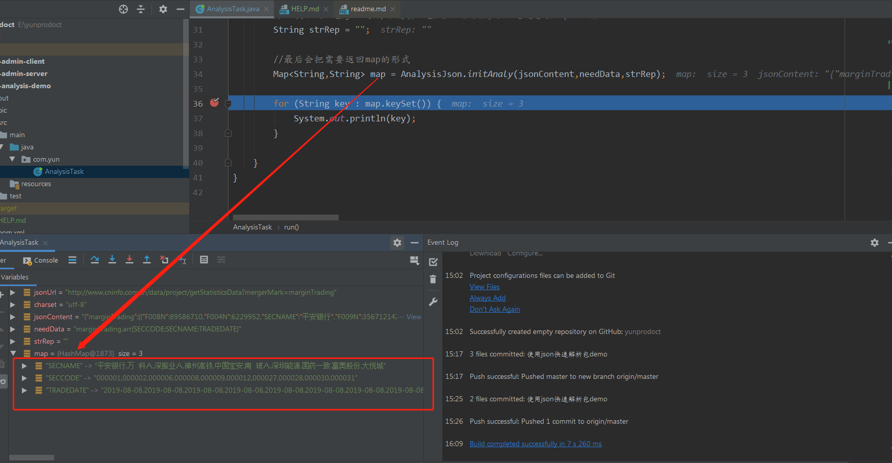

# Readme
### 本项目主要是描述yun_json_analysis_jar的好用之处

* 首先需要下载项目,将项目中的out/artifacts/yun_json_analysis_jar/yun-json-anslysis.jar引入自己的项目中

* 在需要解析json数据时候调用：AnalysisJson.initAnaly(jsonContent,needData,strRep)初始化解析方法就好,其中有三个参数jsonContent,needData,strRep
要注意的是参数的含义：

* 第一个参数是指你需要解析的json数据

* 第二个参数是指你需要的json数据中的内容字段

* 第三个参数是指当字符串一开始不是json的时候需要处理,则把不需要的内容替换掉

* 返回的结果是Map<String,String> 形式类型的

### demo中 run是单层解析以巨潮信息网站的的json为例
json数据格式

图三为我想要的字段数据

图四为解析出来的数据

其中对于needData="" 填写你需要的数据字段：需要注意的是：
 如果需要object的数据时候，写法为：字段_obj
 需要array下的多个字段数据时候： arr{需要字段;需要字段}
 如果array下还有array时,写法为：arr{需要字段!!需要字段;需要字段!!需要字段}
 
###更多的使用方法等后续补上
